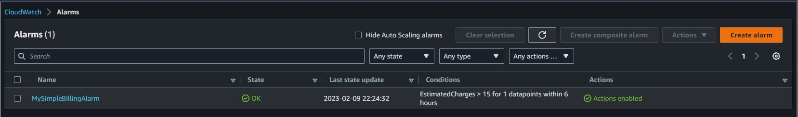
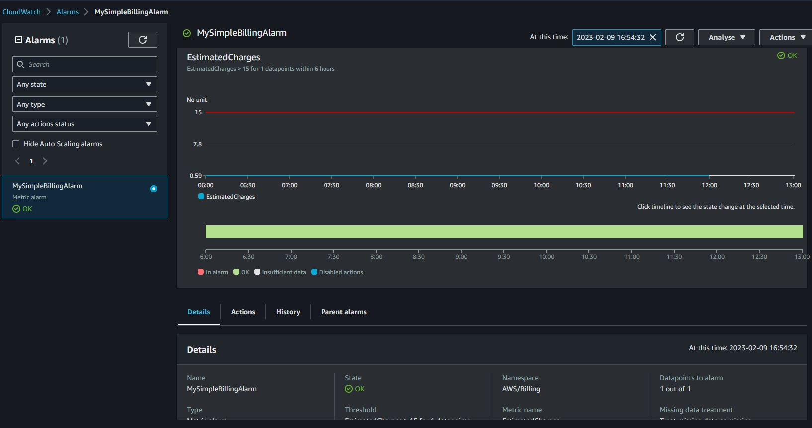
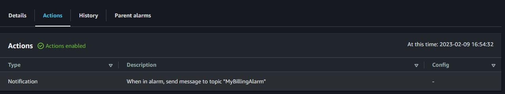
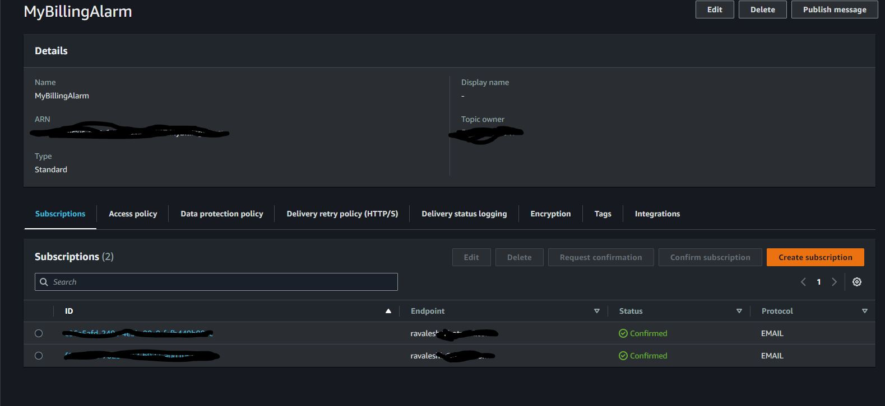
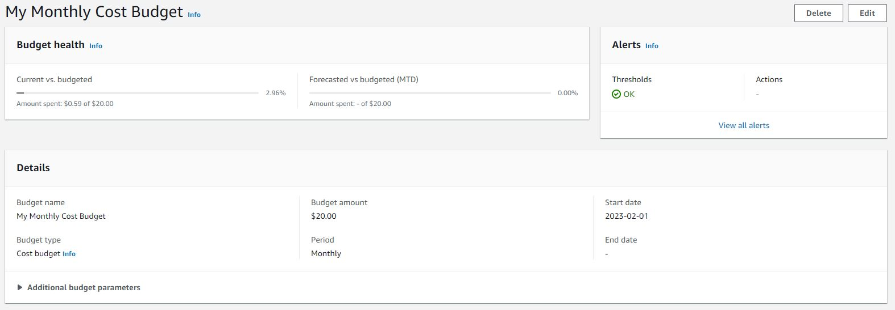
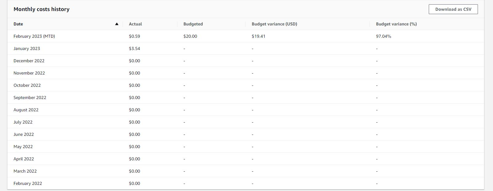
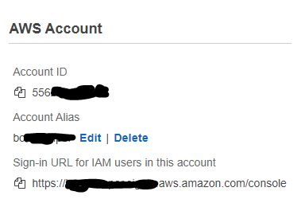
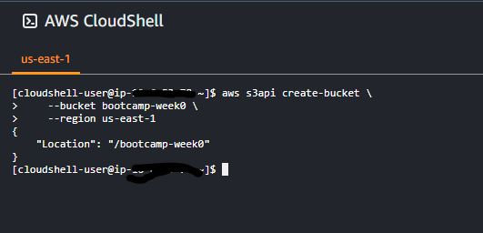
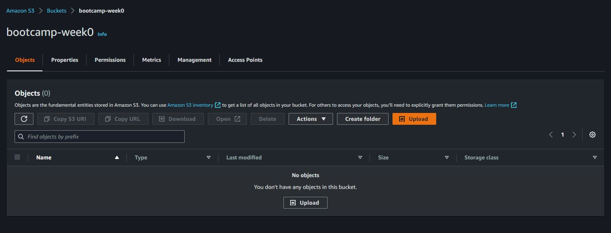
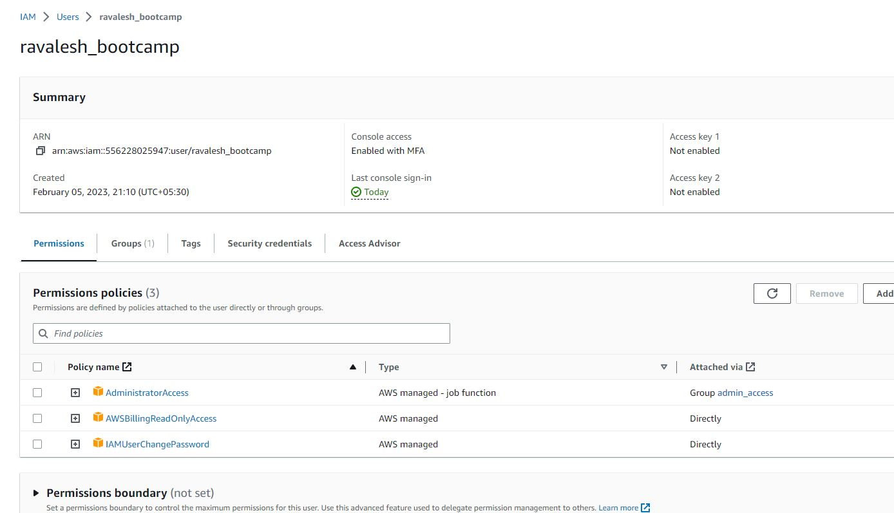

# Week 0 — Billing and Architecture

- Set a Billing alarm.

I logged in to my AWS account and created a Billing alarm following the instructions in the Cloud-Practitioner certification course in the Exampro YouTube channel.

I configured it to send a notification message through the SNS service whenever the estimated cost goes above $15. The SNS would in-turn sens me an email.

Below is the screenshot of the same:

- Set a AWS Budget.

I created a Monthly cose budget for $20 .

Screenshots below:

- Generating AWS Credentials.

I created a new IAM credentials for the bootcamp purpose. I created a new account alias as well. Now I dont have to remember the account-id to login to the console. I also added MFA to the new account.

Screenshots below:

- Using CloudShell

I opened the Cloud shell environment on AWS and created a S# bucket using AWS CLI.

Screenshots below:

- Conceptual Architecture Diagram or your Napkins

Here is teh link to the Conceptual diagram I made for Cuddur during the livestream.

https://lucid.app/lucidchart/ba5b6089-8894-4eb4-af90-c8f6a6b2ab5a/edit?viewport_loc=-288%2C-252%2C2219%2C1065%2C0_0&invitationId=inv_e9e3a751-bbc1-46fb-84f3-d16d6e22e4e6

- Destroy your root account credentials, Set MFA, IAM role

I created an IAM role for muyself and have set MFA for the same. I am planning to use this account throughout the bootcamp journey.

 - Create an architectural diagram (to the best of your ability) the CI/CD logical pipeline in Lucid Charts

 I came up with an archetectural diagram for the CICD process followed in my Company:

 https://lucid.app/lucidchart/a9cee8f6-a310-43a1-bb81-86c847833f3c/edit?viewport_loc=-119%2C-70%2C4039%2C1940%2C0_0&invitationId=inv_0c8c4d6b-0664-4866-a3ec-36ba7f86682e
 