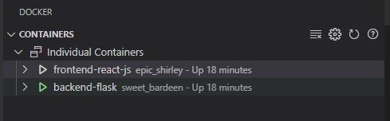
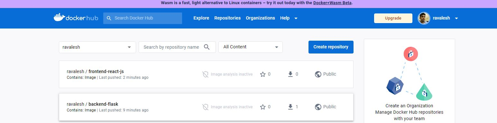
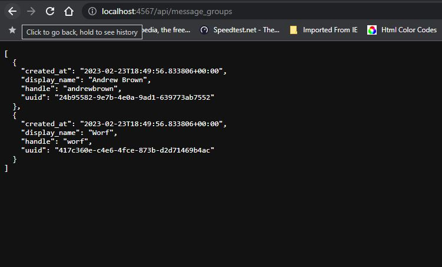

# Week 1 — App Containerization

- Run the dockerfile CMD as an external script

I managed to run the dockerfile via external scipt.

here's the script I came up with:

```
#!/bin/sh

echo "Building the backend image"

docker build -t backend-flask ./backend-flask

echo "Deploying backend image"

docker run -itd -e FRONTEND_URL="https://3000-${GITPOD_WORKSPACE_ID}.${GITPOD_WORKSPACE_CLUSTER_HOST}" -e BACKEND_URL="https://4567-${GITPOD_WORKSPACE_ID}.${GITPOD_WORKSPACE_CLUSTER_HOST}" -p 4567:4567 -v "/$(pwd)/backend-flask:/backend-flask" backend-flask

echo "building front end image"

docker build -t frontend-react-js ./frontend-react-js

echo "deploying frontend image"

docker run -itd -e REACT_APP_BACKEND_URL="https://4567-${GITPOD_WORKSPACE_ID}.${GITPOD_WORKSPACE_CLUSTER_HOST}" -p 3000:3000 -v "/$(pwd)/frontend-react-js:/frontend-react-js" -v "/frontend-react-js/node_modules"  frontend-react-js

```

The above script is commited in the deploy.sh file of the root directory

I was successfully able to run both the backend and front end containers and both containers were able to communicate with each other.



- Push and tag a image to DockerHub

  I already had a docker account created long back.
  
  I had to login to my docker account using the command:`docker login`
  
  I build the backend image using the command: `docker build -t ravalesh/backend-flask:version-1 ./backend-flask`
  
  I pushed the backend image using the command: `docker push ravalesh/backend-flask:version-1`
  
  I build the frontend image using the command: `docker build -t ravalesh/frontend-react-js:version-1 ./frontend-react-js`
  
  I pushed the frontend image using the command: `docker push ravalesh/frontend-react-js:version-1`
  
  I was able to view my images in the docker hub
  
  
  
  Just to experiment, I installed docker desktop in my windows system and I ran the pushed image ocally on my system. I was successfully able to do so I was able to     get the responses from the flask server locally:
  
  
  
  - Use multi-stage building for a Dockerfile build
  
  I managed to use multistage building for the flask-backend.
  
  Here is the Dockerfile script  came up with:
  ```
  FROM python:3.10-slim-buster as builder

  WORKDIR /backend-flask

  COPY requirements.txt requirements.txt

  RUN pip3 wheel --no-cache-dir --no-deps --wheel-dir /wheels -r requirements.txt


  FROM python:3.10-slim-buster

  COPY --from=builder /wheels /wheels

  RUN pip install --no-cache /wheels/*

  COPY . .

  ENV FLASK_ENV=development

  EXPOSE ${PORT}

  CMD [ "python3", "-m" , "flask", "run", "--host=0.0.0.0", "--port=4567"]
  ```
  
  I created a new dockerfile named Dockerfile_multistaged and commited it to the root directory.
  

